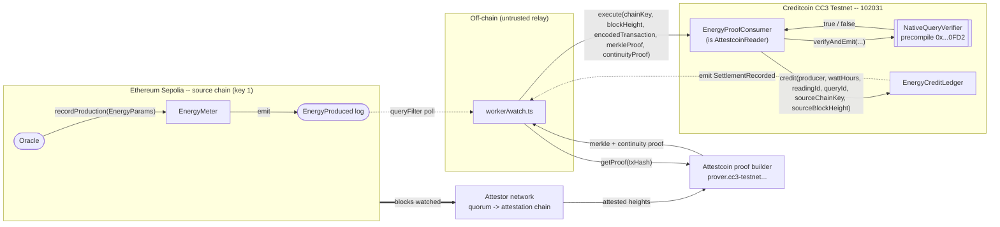
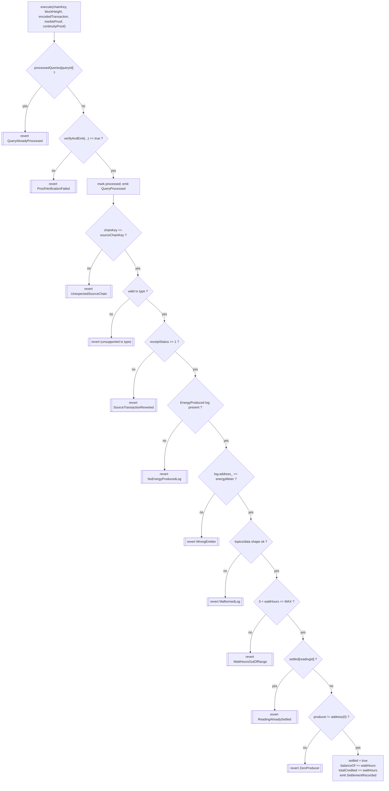
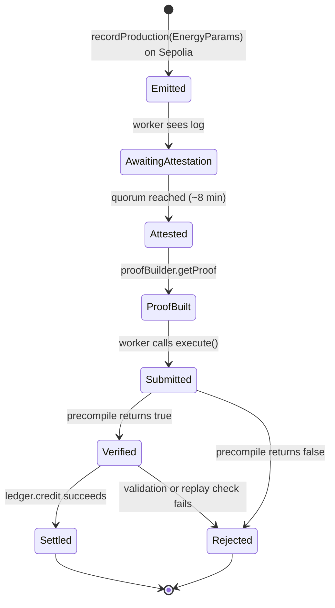
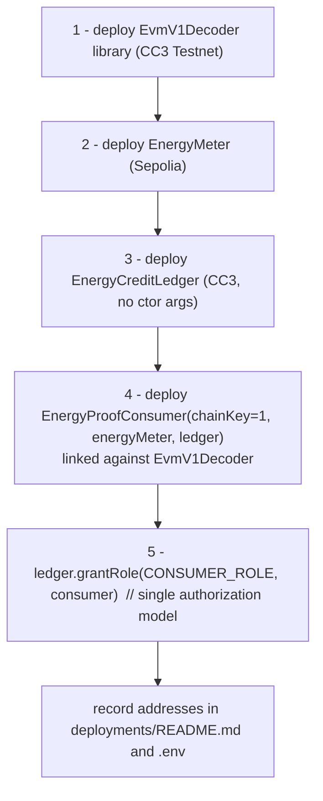

# Diagrams

Mermaid source. Renders on GitHub, in Obsidian, and in most Markdown tools.
A rendered, theme-aware version for the deck lives in the project Artifact.

---

## 1. Components and data flow

What crosses the chain boundary, and who talks to whom.



The worker only relays bytes. Every field the ledger acts on comes from a
transaction the precompile verified as included in an attested Sepolia block.

---

## 2. Happy path (sequence)

```mermaid
sequenceDiagram
    actor P as Producer
    participant EM as EnergyMeter (Sepolia)
    participant W as worker/watch.ts
    participant PB as Proof builder
    participant V as NativeQueryVerifier 0x...0FD2
    participant C as EnergyProofConsumer
    participant L as EnergyCreditLedger

    P->>EM: recordProduction(EnergyParams)
    EM-->>W: EnergyProduced(oracle, producer, readingId, wattHours)
    W->>PB: waitUntilHeightAttested(chainKey=1, block)
    Note over W,PB: ~8 min until the Sepolia block is attested
    W->>PB: getProof(txHash)
    PB-->>W: { txBytes, merkleProof, continuityProof }
    W->>C: execute(chainKey, height, txBytes, merkleProof, continuityProof)
    C->>C: queryId = keccak(chainKey, height, txIndex)
    C->>C: revert if processedQueries[queryId]
    C->>V: verifyAndEmit(chainKey, height, txBytes, merkleProof, continuityProof)
    V-->>C: true
    C->>C: decode receipt; status==1; find EnergyProduced log; emitter==EnergyMeter; bounds
    C->>L: credit(producer, wattHours, readingId, queryId, chainKey, blockHeight)
    L->>L: revert if settled[readingId]
    L-->>W: SettlementRecorded(producer, wattHours, readingId, queryId, newBalance)
```

---

## 3. The verification gate (consumer validation)

Every check and the revert it raises. Left column is the pass-through path.



---

## 4. Lifecycle of one reading



---

## 5. Deploy order

The two Creditcoin contracts need each other's address, so the ledger takes its
consumer in a one-shot call after both are deployed.


